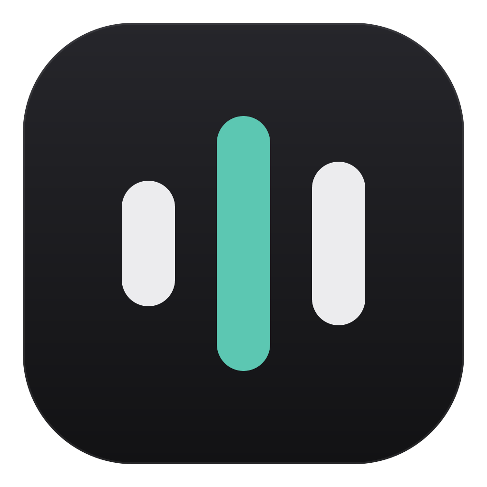
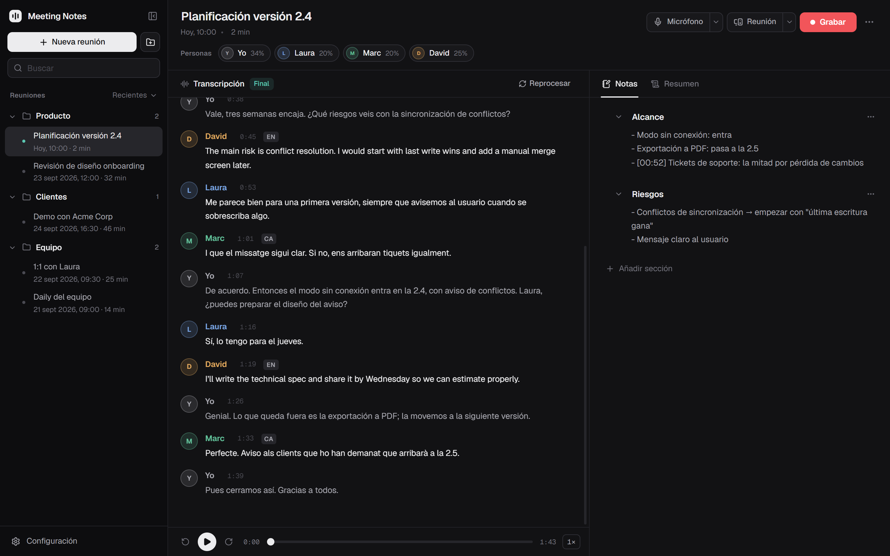
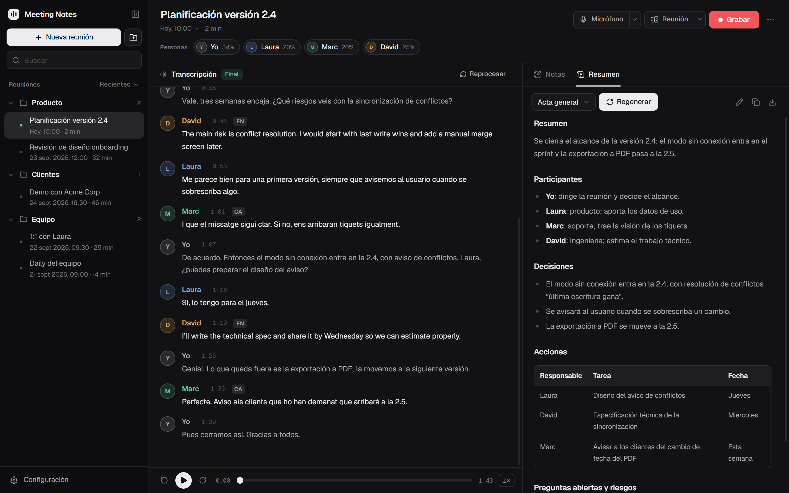
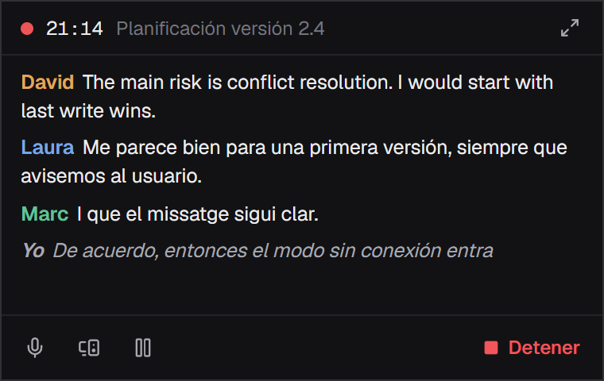
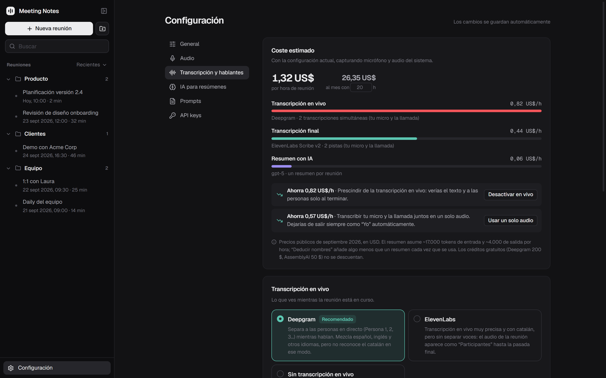

<div align="center">



# Meeting Notes

**Transcribe tus reuniones, separa a cada persona y termina con un acta lista para compartir.**

Funciona con Teams, Google Meet, Zoom, Discord o cualquier aplicación que suene en el equipo.

[](https://github.com/AleDev11/meeting-notes/releases/latest)
[](https://github.com/AleDev11/meeting-notes/actions/workflows/ci.yml)
[](LICENSE)


[**Descargar para Windows**](https://github.com/AleDev11/meeting-notes/releases/latest) ·
[Instalar desde el código](#desde-el-código) ·
[Contribuir](CONTRIBUTING.md)

<br>



</div>

## Quién dijo qué, en cualquier idioma

- **Tu voz aparte.** Tu micrófono y el audio de la llamada se graban y transcriben por separado: lo que dices tú
  siempre sale con tu nombre y el resto se separa en Persona 1, 2, 3… Si usas altavoces, el eco que recoge el
  micrófono se descarta.
- **En directo y al terminar.** Ves la transcripción mientras hablan (Deepgram o ElevenLabs) y, al detener, se
  procesa la grabación completa con un modelo más preciso (ElevenLabs Scribe v2, AssemblyAI o Deepgram). Los nombres
  que pongas durante la reunión se conservan.
- **Varios idiomas.** La conversación puede pasar del español al inglés o al catalán: cada parte se transcribe en su
  idioma y se marca.
- **Personas.** Renombra, fusiona, reasigna intervenciones o deja que la IA deduzca los nombres a partir de la
  conversación.
- **Vocabulario propio.** Nombres, productos y siglas que se reconocen sin errores.

## Del audio al acta



- **Notas por secciones** que puedes reordenar, con marcas de tiempo (`Ctrl+T`) mientras grabas.
- **Actas con Claude u OpenAI** a partir de plantillas editables: general, 1:1, daily, cliente, entrevista.
- **Escucha la grabación** desde cualquier frase. La transcripción sigue al audio y puedes corregir el texto con
  doble clic.
- **Busca en todas tus reuniones**: títulos, transcripciones, notas y actas, sin importar tildes ni mayúsculas. Al
  abrir un resultado, la transcripción salta a la coincidencia.
- **Exporta a Markdown** con el acta, las notas y la transcripción.

## Sin estorbar durante la reunión

<table>
<tr>
<td width="400"></td>
<td>

- **Modo mini:** una ventana pequeña, siempre visible, con las últimas frases en directo.
- **Graba la pantalla** que elijas junto con el audio, para no perder las presentaciones. Al empezar te pregunta si
  quieres grabarla y puedes activarla o desactivarla en cualquier momento. El vídeo se reproduce sincronizado con la
  transcripción y se guarda en MP4.
- **Nunca pierdes una reunión.** Si un proveedor se queda sin crédito o sin conexión a mitad, se sigue grabando y te
  avisa. La transcripción queda pendiente y se hace sola en cuanto vuelve a funcionar.
- **Pausa y silencio:** para tu micrófono o el audio de la reunión cuando no quieras que se grabe.
- **En segundo plano:** vive en la bandeja del sistema, con acciones rápidas para crear una reunión y empezar a
  grabar. Puede iniciarse con Windows.

</td>
</tr>
</table>

## Tus datos, tus claves



- **Todo en local.** Las reuniones se guardan en tu equipo; solo salen hacia los proveedores que elijas.
- **Tus propias API keys**, guardadas cifradas con `safeStorage` (DPAPI en Windows).
- **Coste estimado** por hora de reunión según los proveedores y modelos que elijas, con sugerencias para ahorrar.
- **Actualizaciones automáticas:** las versiones nuevas se descargan solas y se instalan al reiniciar.

## Instalación

Descarga el instalador desde la [última release](https://github.com/AleDev11/meeting-notes/releases/latest).
Todavía no está firmado, así que Windows SmartScreen mostrará un aviso la primera vez.

Necesitas la API key de al menos un proveedor de transcripción (Deepgram, ElevenLabs o AssemblyAI) y, para las actas,
de Anthropic u OpenAI. Se añaden desde **Configuración > API keys**.

### Desde el código

Requisitos: Windows 10 u 11, [Bun](https://bun.sh) y Node.js 24 o superior.

```bash
git clone https://github.com/AleDev11/meeting-notes.git
cd meeting-notes
bun install
bun run dev
```

Las keys también pueden ir en `.env.local` (ver `.env.example`); la app las usa si no están configuradas en la
aplicación. Para generar el instalador: `bun run dist`.

Las reuniones se guardan en `%APPDATA%/meeting-notes/library`.

## Estructura

```
src/main/            proceso principal de Electron
  transcription/     proveedores: deepgram, elevenlabs, assemblyai
  speakers.ts        hablantes, eco del micrófono y alineación en vivo/final
  summarize.ts       actas y deducción de nombres
  background.ts      bandeja del sistema, acciones rápidas e inicio con Windows
  mini.ts            ventana del modo mini
  store.ts           biblioteca en disco
  library-index.ts   índice SQLite para listar y buscar (FTS5)
src/preload/         puente IPC
src/renderer/        interfaz en React
src/shared/          tipos y tarifas compartidos
```

## Contribuir

Consulta [CONTRIBUTING.md](CONTRIBUTING.md). Para vulnerabilidades, [SECURITY.md](SECURITY.md).

## Licencia

[MIT](LICENSE)
